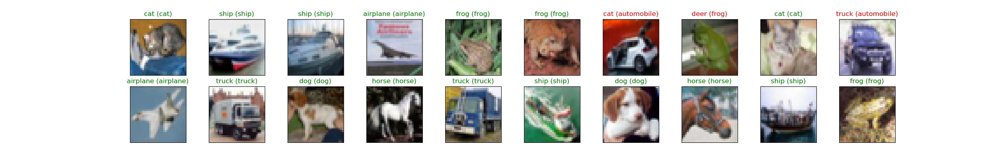
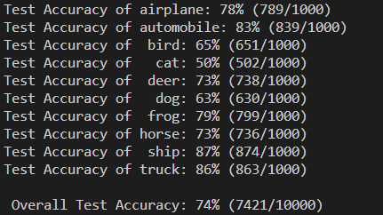

I create a simple CNN for CIFAR 10 dataset. I use 3 convolution layers, each with small kernels of size 3 X 3. I use RELU as the activation function, and after each layer I use a 2 X 2 Maxpool unit. Finally, I have two fully connected layers. I use dropout (with drop probability of 20%) before both layers. I use Cross Entropy Loss as the loss function and Adam optimizer as my optimizer of choice.

The model runs for 30 epochs and generates a test accuracy of 74%. The model seems to do well with automobiles, but isn't great with cat and birds (may be due to lots of colours?). Adding a few more convolution layers might address this issue.

