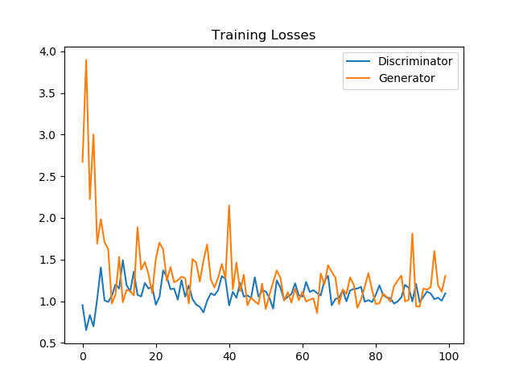
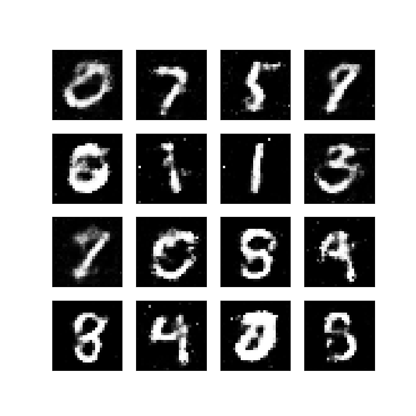

I develop a GAN that generates digits based on MNIST dataset. I use simple generator and discriminator networks, with four fully connected layers in both. Note, it might be better to use convolution and transpose convolution layers instead. I use leaky-RELU as the activation function in both, and the tanh activation for final layer of Generator. The overall GAN pipeline looks like this:

Both the Generator and Discriminator are trained using Adam optimizer. For loss computation, I use BCEWithLogitsLoss, which is a combination of sigmoid with binary cross entropy, and is provided by Pytorch. The individual losses for Generator and Discriminator are as follows:

After training for 100 epochs, the Generator generated the below images:

Overall, the change from epoch 1 to epoch 100 is depicted by the below GIF:

