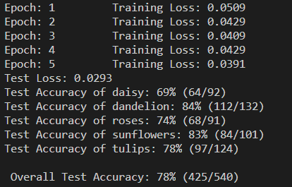

I use transfer learning to use pretrained VGG16 from Pytorch, which is trained on Imagenet, as a feature extractor. I replace the final fully connected layer in the VGG with my own classifier. I train on Flower dataset, available [here](https://s3.amazonaws.com/video.udacity-data.com/topher/2018/September/5baa60a0_flower-photos/flower-photos.zip). The dataset has 5 classes, hence my final layer has an output of 5 values. I use cross entropy loss and adam optimizer and train the final classifier for 5 epochs. It is important to note that we do not propogate the values back to the layers of feature extractor of VGG16 during back propogation. 

I achieve an overall test accuracy of 78% after just 5 epochs:
